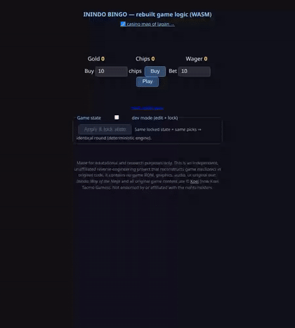
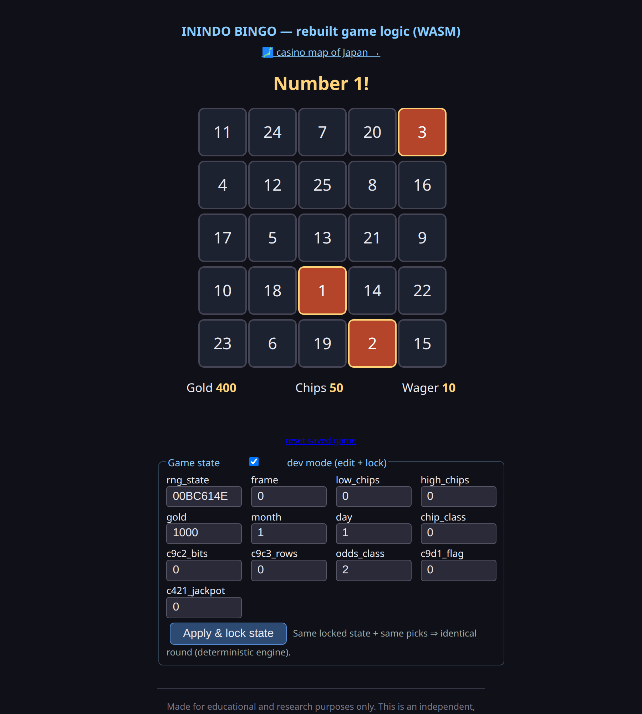
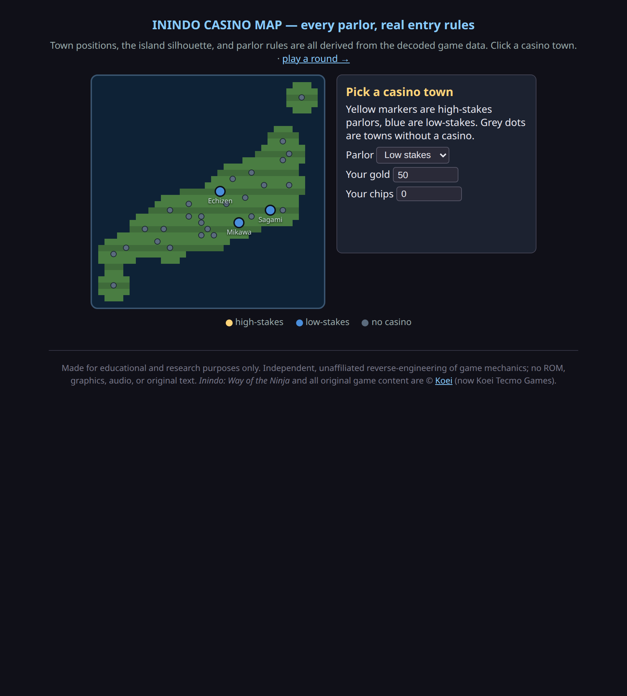
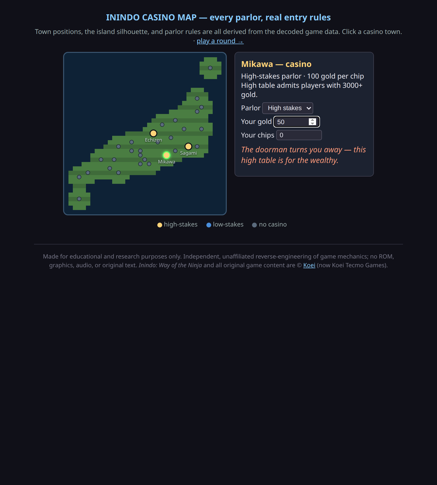

# Inindo Bingo

A browser-playable reconstruction of the bingo/casino minigame from the SNES
game *Inindo: Way of the Ninja* — built as an **educational reverse-engineering
project**. The game logic was decoded from the original machine code and
re-implemented from scratch in Rust, then compiled to WebAssembly.

**[▶ Play it](https://Banon-Labs.github.io/inindo-bingo/)** · **[🗾 Casino map](https://Banon-Labs.github.io/inindo-bingo/map.html)**

  
  
  

## What this is

- An independent, from-scratch implementation of the minigame's **rules and
  math** (chip purchase, wager, board generation, called numbers, special
  results, payouts), reconstructed from analysis of the original program.
- Runs entirely in your browser via WebAssembly. No server, no install.
- A **dev mode** exposing every internal state variable, so you can lock a
  seed and watch the deterministic engine reproduce a round exactly.

## What this is not

- It contains **no game ROM, graphics, audio, or original text**. All on-screen
  wording is paraphrased; only reconstructed mechanics are shipped.
- It is not a copy of, or a substitute for, the original game.

## Demo / tests

A Playwright end-to-end script drives the whole feature set and records the
GIF above plus per-feature screenshots. See [`e2e/`](e2e/).

## Legal

Made for educational and research purposes only. This is an unaffiliated fan
reverse-engineering project. *Inindo: Way of the Ninja* and all original game
content are © [Koei](https://en.wikipedia.org/wiki/Koei) (now Koei Tecmo
Games). This project is not endorsed by or affiliated with the rights holders.
The original-authored reconstruction code is released for educational use.
